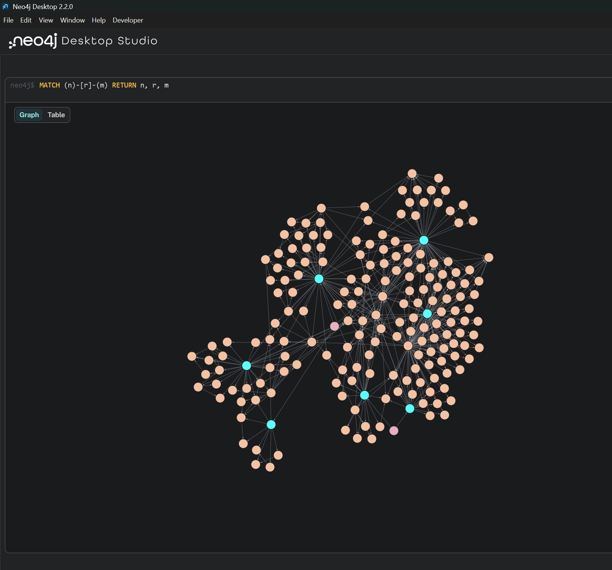

<p align="center">
  <h1 align="center">OpenRAG</h1>
  <p align="center">
    <strong>Open-source Retrieval-Augmented Generation with dual vector + knowledge-graph backends</strong>
  </p>
  <p align="center">
    <code>Chroma</code> · <code>Neo4j</code> · <code>Ollama</code> · <code>HuggingFace</code> · <code>LangChain</code> · <code>FastAPI</code> · <code>React</code>
  </p>
</p>

---

## Overview

**OpenRAG** is a production-ready RAG framework that lets you ingest documents, build retrievable knowledge stores, and query them with open-source LLMs, all running locally on your own hardware. No API keys for proprietary models required.

Choose between two retrieval backends at configuration time:

| Backend | How it works | Best for |
|---|---|---|
| **Chroma** (vector) | Bi-encoder embeddings → cosine similarity search | Fast similarity retrieval, general Q&A |
| **Neo4j** (graph) | LLM-extracted entities & relationships → Cypher graph traversal | Relational queries, entity-centric exploration |

Both paths feed into a **cross-encoder reranker** (`BAAI/bge-reranker-base`) that re-scores candidates for calibrated relevance before the answer LLM generates a cited response.

## Key Features

- **Dual retrieval backends:** Chroma (vector DB) for similarity search, or Neo4j (graph DB) for pure knowledge-graph traversal
- **Knowledge-graph construction:** `LLMGraphTransformer` extracts entities and typed relationships from each chunk; automatic entity deduplication via embedding similarity + word-subset matching
- **Two-stage retrieval:** over-retrieve candidates from the backend, then cross-encoder rerank (`BAAI/bge-reranker-base`) for calibrated relevance scoring
- **Multi-format ingestion:** PDF and DOCX with metadata preservation
- **Flexible chunking:** fixed-size (`RecursiveCharacterTextSplitter`) or embedding-based semantic splitting (`SemanticChunker`)
- **Open-source LLMs:** local inference via Ollama (Llama 3, Mistral, Gemma, etc.) or HuggingFace Transformers (Qwen, Gemma, Falcon, etc.); cloud-hosted Ollama models also supported
- **Separate graph-extraction LLM:** configure a different (smaller/faster) model for knowledge-graph construction
- **GPU auto-detection:** CUDA for embeddings and inference when available, seamless CPU fallback
- **Full-stack web UI:** React + TypeScript + Tailwind wizard interface with a typed REST API
- **CLI interface:** scriptable batch ingest and query for automation workflows
- **Live model warmup:** background LLM download with byte-level progress tracking
- **HuggingFace cache management:** inspect and clear downloaded models from the UI

## Architecture

```
Document (PDF/DOCX)
    │
    ▼
Document Loader ──► Text Chunking ───────────► Embedding Generation
                    (fixed/SemanticChunker)    (sentence-transformers)
                                            │
                        ┌───────────────────┴───────────────────┐
                        ▼                                       ▼
                   Chroma (vector DB)                   Neo4j (graph DB)
                  similarity search                  entity → Cypher → :MENTIONS
                        │                                       │
                        └───────────────┬───────────────────────┘
                                        ▼     (one backend, chosen at config)
                              Cross-encoder Reranker
                              (BAAI/bge-reranker-base)
                                        │
                                        ▼
                                LLM Generation
                         (Ollama / HuggingFace - local)
                                        │
                                        ▼
                              Answer with citations
```

## Getting Started

### Prerequisites

| Dependency | Required | Notes |
|---|---|---|
| **Python 3.10+** | Always | With `pip` |
| **Node.js 18+** | Always | With `npm` (for the web UI) |
| **Neo4j 5.x + APOC** | Graph backend only | APOC plugin needed for `LLMGraphTransformer` writes |
| **Ollama** | If using Ollama provider | Install locally or use cloud-hosted models (`:cloud` suffix) |

### 1. Install Python dependencies

```bash
cd OpenRAG
pip install -r requirements.txt
```

### 2. Install web UI dependencies (first run only)

```bash
cd web
npm install
cd ..
```

### 3. Configure environment

Create a `.env` file in the project root. The only values required upfront are Neo4j credentials (when using the `neo4j` backend):

```bash
NEO4J_URI=bolt://localhost:7687
NEO4J_USERNAME=neo4j
NEO4J_PASSWORD=your_password   # required when backend = neo4j
```

All other settings (backend, chunking, models) are configured through the web UI at runtime.

### 4. Start the application

**Option A - PowerShell launcher (recommended on Windows):**

```powershell
./start_dev.ps1
```

**Option B - Manual (two terminals):**

```bash
# Terminal 1 - FastAPI backend on :8000
python -m uvicorn api.main:app --reload --port 8000

# Terminal 2 - Vite dev server on :5173 (proxies /api/* to :8000)
cd web
npm run dev
```

Open **http://localhost:5173/** in your browser and walk through the four-step wizard.

### 5. Production deployment

Build the frontend once, then serve everything from the FastAPI backend:

```bash
cd web && npm run build && cd ..
python -m uvicorn api.main:app --port 8000
```

Access at **http://localhost:8000/**.

## Usage

The web UI guides you through a four-step wizard:

| Step | Page | What you do |
|---|---|---|
| 1 | **Configuration** | Select retrieval backend (`vector` or `neo4j`), chunking strategy, top-k |
| 2 | **Models** | Choose embedding model, answer LLM (Ollama / HuggingFace), and graph-extraction LLM |
| 3 | **Documents** | Upload PDF / DOCX files and ingest into the configured stores |
| 4 | **Chat** | Ask questions with RAG-cited answers or free-form chat mode |

The **Reset** button (top-right) wipes all selections, uploaded files, chat history, and the cached pipeline.

## CLI

The full pipeline is scriptable for batch workflows. All examples assume your virtual environment is active.

### Chroma (vector) backend

```bash
# Ingest documents
python -m rag_brain --backend vector --ingest "document.pdf"
python -m rag_brain --backend vector --ingest "report.docx"
python -m rag_brain --backend vector --ingest "document.pdf" --chunking semantic

# Append to existing collection
python -m rag_brain --backend vector --ingest "document.pdf" --no-recreate

# Query
python -m rag_brain --backend vector --query "What are the key findings?" --rag
python -m rag_brain --backend vector --query "What are the key findings?" --rag --show-chunks
```

### Neo4j (graph) backend

```bash
# Ingest documents
python -m rag_brain --backend neo4j --ingest "document.pdf"
python -m rag_brain --backend neo4j --ingest "report.docx"
python -m rag_brain --backend neo4j --ingest "document.pdf" --chunking semantic

# Append to existing index
python -m rag_brain --backend neo4j --ingest "document.pdf" --no-recreate

# Query
python -m rag_brain --backend neo4j --query "What are the key findings?" --rag
python -m rag_brain --backend neo4j --query "What are the key findings?" --rag --show-chunks
```

### Explore the knowledge graph

After ingesting with the `neo4j` backend, browse the extracted entity-relation graph in **Neo4j Browser**:

🔗 **[http://localhost:7474](http://localhost:7474)**

Log in with your `NEO4J_USERNAME` / `NEO4J_PASSWORD`, then run:

```cypher
MATCH (n)-[r]-(m) RETURN n, r, m
```

For larger graphs, append `LIMIT 500` to keep the renderer responsive.

<p align="center">
  
</p>

### CLI Reference

```
python -m rag_brain [OPTIONS]

Options:
  --backend {vector,neo4j}        Retrieval backend (default: vector)
  --ingest PATH                   Path to PDF or DOCX file to ingest
  --query TEXT                    Question to ask
  --chunking {fixed,semantic}     Chunking strategy (default: fixed)
  --no-recreate                   Add to existing collection instead of rebuilding
  --show-chunks                   Print retrieved chunks as JSON after the answer
  --rag                           Answer from documents (retrieve + rerank + cite)
```

## API Reference

The FastAPI backend exposes a typed REST API. All endpoints are prefixed with `/api`.

| Endpoint | Method | Description |
|---|---|---|
| `/api/health` | `GET` | Health check |
| `/api/presets` | `GET` | Available embedding and LLM model presets |
| `/api/config` | `GET` | Current pipeline configuration |
| `/api/config` | `PUT` | Update pipeline configuration |
| `/api/reset` | `POST` | Reset all state (config, pipeline, ingested files) |
| `/api/warmup` | `POST` | Start background LLM download/load |
| `/api/warmup/status` | `GET` | Live download progress (poll every ~250ms) |
| `/api/ingest` | `POST` | Upload and ingest PDF/DOCX files |
| `/api/query` | `POST` | Ask a question (RAG or chat mode) |
| `/api/debug/graph` | `GET` | Inspect Neo4j graph (entity counts, sample entities) |
| `/api/cache/hf` | `GET` | List HuggingFace cached models |
| `/api/cache/hf` | `DELETE` | Clear all HuggingFace cache |
| `/api/cache/hf/{repo_id}` | `DELETE` | Remove a specific cached model |

## Configuration Reference

All settings are read from `.env` in the project root. Values set through the web UI override these defaults at runtime.

| Variable | Default | Description |
|---|---|---|
| `RAG_BACKEND` | `vector` | `vector` or `neo4j` |
| `CHUNKING_STRATEGY` | `fixed` | `fixed` or `semantic` |
| `CHUNK_SIZE` | `1200` | Characters per chunk |
| `CHUNK_OVERLAP` | `200` | Overlap between chunks |
| `TOP_K` | `4` | Number of chunks to retrieve |
| `CHROMA_PERSIST_DIR` | `./data/chroma_db` | Chroma storage path |
| `CHROMA_COLLECTION` | `rag_docs` | Chroma collection name |
| `NEO4J_URI` | `bolt://localhost:7687` | Neo4j connection URI |
| `NEO4J_USERNAME` | `neo4j` | Neo4j username |
| `NEO4J_PASSWORD` | _(required)_ | Neo4j password |
| `NEO4J_DATABASE` | `neo4j` | Neo4j database name |
| `NEO4J_VECTOR_INDEX` | `rag_chunk_vectors` | Neo4j vector index name |
| `EMBEDDING_MODEL` | `sentence-transformers/all-MiniLM-L6-v2` | HuggingFace embedding model |
| `LLM_PROVIDER` | `ollama` | `ollama` or `huggingface` |
| `OLLAMA_BASE_URL` | `http://localhost:11434` | Ollama API URL |
| `OLLAMA_MODEL` | `llama3` | Answer LLM (Ollama model name) |
| `HF_MODEL` | `Qwen/Qwen2.5-1.5B-Instruct` | Answer LLM (HuggingFace model ID) |
| `HF_TOKEN` | _(empty)_ | Optional HF token for gated repos |
| `GRAPH_LLM_PROVIDER` | `none` | `none`, `ollama`, or `huggingface` |
| `GRAPH_LLM_MODEL` | _(empty)_ | Model name for graph-extraction LLM |
| `GRAPH_LLM_WORKERS` | `1` | Parallel chunks during graph extraction |

## Project Structure

```
OpenRAG/
├── .env                        # Environment-specific configuration
├── start_dev.ps1               # PowerShell launcher (FastAPI + Vite)
├── requirements.txt            # Python dependencies
├── rag_brain/                  # Core RAG package
│   ├── __init__.py             # Package exports + HF log suppression
│   ├── __main__.py             # CLI entry point
│   ├── config.py               # Settings (Pydantic) + enums
│   ├── ingestion.py            # PDF/DOCX loading + chunking
│   ├── embeddings.py           # Embedding model init (GPU auto-detect)
│   └── pipeline.py             # RAGPipeline: ingest, retrieve, rerank, query
├── api/                        # FastAPI backend
│   ├── main.py                 # REST API routes
│   ├── state.py                # Process-level pipeline singleton
│   ├── schemas.py              # Pydantic request/response models
│   ├── presets.py              # Embedding / LLM model preset lists
│   └── warmup.py               # Background model download with progress
└── web/                        # React frontend (Vite + TypeScript + Tailwind)
    ├── index.html
    ├── package.json
    ├── vite.config.ts
    ├── tailwind.config.js
    └── src/
        ├── main.tsx            # React entrypoint
        ├── App.tsx             # Top-level wizard router
        ├── lib/                # API client + shared types
        ├── components/         # Header, Stepper, Banner, Chip, …
        └── pages/              # Home, Configuration, Models, Documents, Chat
```

## Tech Stack

| Category | Technologies |
|---|---|
| **Orchestration** | LangChain, LangChain Experimental |
| **Vector Database** | ChromaDB |
| **Graph Database** | Neo4j + APOC |
| **Embeddings** | Sentence Transformers (MiniLM, MPNet, BGE, E5) |
| **Reranking** | BAAI/bge-reranker-base |
| **LLM Inference** | Ollama, HuggingFace Transformers |
| **Document Processing** | PyPDF, python-docx |
| **Backend** | FastAPI, Uvicorn |
| **Frontend** | React, Vite, TypeScript, TailwindCSS |
| **Configuration** | Pydantic Settings, python-dotenv |

## License

This project is open-source. See the [LICENSE](LICENSE) file for details.
